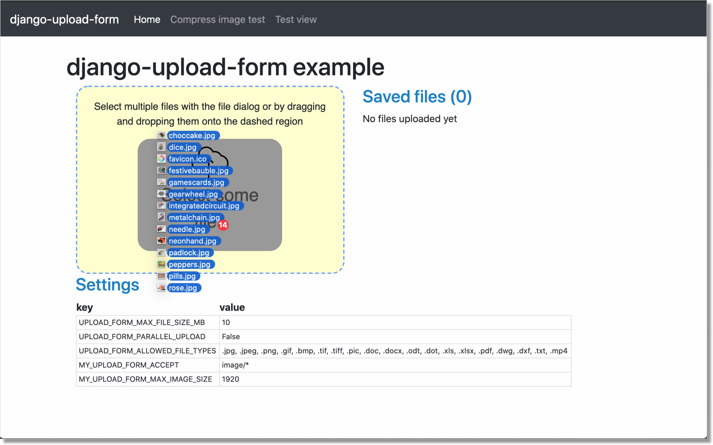
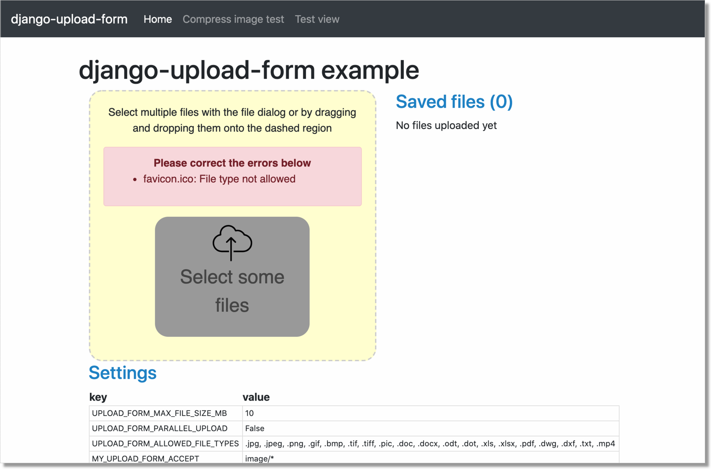
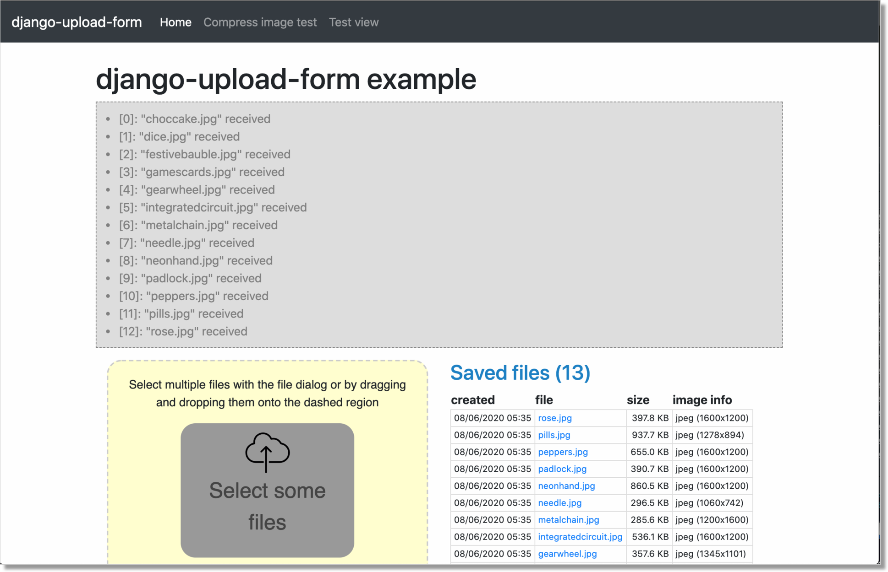
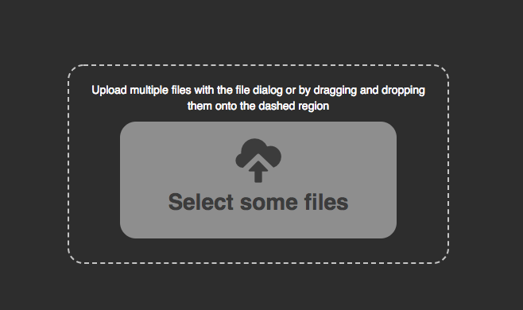
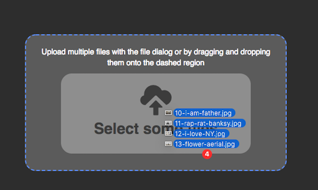
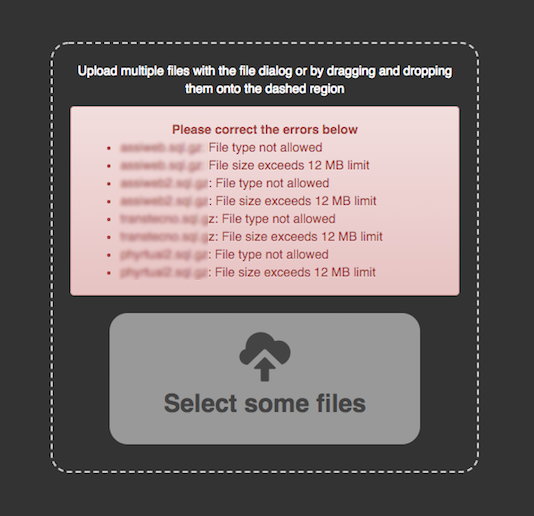
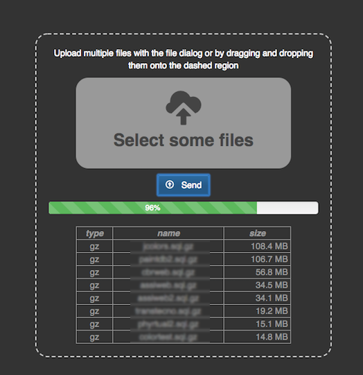

django-upload-form
==================

A minimal (yet careful about UX) solution to upload multiple files in a Django project,
using a Django-like Form Class.

Purpose
-------

The purpose of this module is that of providing a simple yet effective tool
for managing the user interaction for files uploading in a Django projects,
with the following features:

1) before submission:

    - files can be added to the upload list either via drag&drop or with an file-open dialog
    - user can revise the upload list by adding or removing files
    - the list displays informations about the files (name, tipe, size)

2) during submission:

    - image files are optionally resized up to a configurabile max resolution
    - a progress bar is shown during files upload

3) after submission:

    - a target view receives the uploaded files via an Ajax POST request
    - here, you will validate the form ...
    - ... and use the received `files` at your will

All this is obtained by leveraging HTML5 specific capabilities, and applying some clever (in my opinion)
and sometimes hacky techniques I learned from a few selected articles, listed in the `References`
section below.

No external dependencies are required (other than jQuery).

The codebase is deliberately minimal.

How to use `django-upload-form`
-------------------------------

The only purpose of the package is that of:

- managing user interaction
- upload the files upon form submission

**What you do with the uploaded files is entirely up to you, and you're responsible for this.**

These are the steps required to use `django-upload-form`:

- derive your own Form class from UploadForm, and override a few methods
- provide a view which will be the target for files upload

The UploadForm-derived class
----------------------------

At the very minimum, you need to override the following methods:

- form_valid(self, request)
    Here is where you receive the list of (in-memory) uploaded files after submission;
    What you do with the uploaded files is entirely up to you.
    This method should normally return `get_success_url()`.

- get_success_url(self)
    Determine the URL to redirect to when the form is successfully validated.

- get_action(self, request=None)
    Returns the url of the `target view` (see below).

Optionally, you can customize the following instance properties:

- self.allowed_file_types
    List of allowed file types (ex: '.xls .xlsx .pdf');
    Default to: None, which means we'll use the corresponding setting `UPLOAD_FORM_ALLOWED_FILE_TYPES`

- self.accept
    Returns the value for the "accept" attribute of the file input element;
    Defaults to: None, which means we'll build it from `self.allowed_file_types` list;
    Example: `image/\*` - which also trigger the lookup into the image gallery on mobile devices

- self.max_image_size
    When > 0, images will be resized accordingly before uploading.
    The required size is expressed in pixels.
    Default: 0

or override the corresponding methods:

- def get_accept(self, request=None)
- def get_max_image_size(self, request=None)

Note: while "accept" is applied to the file input element, "allowed_file_types" is
used during form validation; it is your responsability to supply coherent values.

When "accept" is None, on the other side, this is guaranteed by UploadForm.

The target view
---------------

The target view will receive the uploaded files with a POST request, and normally should:

    - build a bounded form
    - validate it
    - invoke form_valid()

You will probably use the same view for form rendering (GET); this is quite common
practice, but entirely optional.

Also note that, since upon form submission the POST request will be issued via Ajax,
the target view should cooperate by returning a JsonResponse().

In practice, in the target view **you should always follow the pattern below**,
then cope with your specific needs in `MyUploadForm.form_valid()`:

.. code:: python

    def sample_view(request):

        if request.method == 'GET':
            form = TestUploadForm()
        else:
            form = TestUploadForm(request.POST, request.FILES)
            if form.is_valid():
                url = form.form_valid(request)
                return JsonResponse({'action': 'redirect', 'url': url, })
            else:
                return JsonResponse({'action': 'replace', 'html': form.as_html(request), })

        return render(
            request,
            'upload_form/test_view.html', {
                'form': form,
                'form_as_html': form.as_html(request),
            }
        )

or (when the initial rendering if provided by some other view):

.. code:: python

    def sample_view(request):

        assert request.method == 'POST'
        assert request.is_ajax()

        form = MyUploadForm(request.POST, request.FILES)
        if form.is_valid():
            url = form.form_valid(request)
            return JsonResponse({'action': 'redirect', 'url': url, })
        else:
            return JsonResponse({'action': 'replace', 'html': form.as_html(request), })

Installation
------------

Install the package from Python Package Index running:

.. code:: bash

    pip install django-upload-form

or from GitHub:

.. code:: bash

    pip install git+https://github.com/morlandi/django-upload-form@master

then add 'upload_form' to your INSTALLED_APPS:

.. code:: bash

    INSTALLED_APPS = [
        ...
        'upload_form',
    ]

App Settings
------------

Some settings are provided for optional customization.

The library will search these settings in the following order:

    - as `Django Constance` dynamic settings (see `https://github.com/jazzband/django-constance <https://github.com/jazzband/django-constance>`_)
    - failing that, in project's settings
    - failing that, a suitable "safe" default value is used

.. code:: python

    UPLOAD_FORM_MAX_FILE_SIZE_MB = 12
    UPLOAD_FORM_ALLOWED_FILE_TYPES = ".png .jpg .jpeg .gif"
    UPLOAD_FORM_PARALLEL_UPLOAD = False  (experimental)

or:

.. code:: python

    CONSTANCE_CONFIG = {
        ...
        'UPLOAD_FORM_ALLOWED_FILE_TYPES': (".png .jpg .jpeg .gif", "Tipi di files abilitati all'upload"),
        'UPLOAD_FORM_MAX_FILE_SIZE_MB': (12, 'Dimensione massima files in upload (MB)'),
        'UPLOAD_FORM_PARALLEL_UPLOAD': (False, "Activate concurrent files upload"),
    }

Using multiple upload forms in a single HTML page
-------------------------------------------------

The technique used to collect files for upload is:

- render an **hidden** file input element with "multiple" attribute
- use a label styled to look like a button, so people will realize they can click it to bring up the file selection dialog

This works, since pressing a label basically triggers the focus event for the bound input;
if it is a file input, it works out as a click event, resulting in opening a file browser.

.. code:: html

    <input style="display: none;" type="file" name="files[]" accept="{{accept}}" id="uploadform_file_input" multiple onchange="UploadForm.handleFiles(this.files)">
    <label class="button" for="uploadform_file_input">
        
        

            
        

    </label>

Unfortunately, this means we had to assign a specific id to the <input> element;
which in turn means we can't use two upload forms in a single HTML page.

However, you can also implicitly bind a label to an input by inclusion, thus avoiding the id altoghether:

.. code:: html

    <label class="button">
        <input style="display: none;" type="file" name="files[]" accept="{{accept}}" multiple onchange="UploadForm.handleFiles(this.files)">
        
        

            
        

    </label>

This fix has been added in `v0.4.3`.

Example project
---------------

A simple Django project is available in folder 'example'; use it as follows:

.. code-block:: bash

    # Move to the project folder
    cd ./example

    # Install Django dependencies
    pip install -r requirements.txt

    # Initialize database tables
    python manage.py migrate

    # Create a super-user for the admin:
    python manage.py createsuperuser

    # Run the project
    python manage.py runserver

the visit either http://127.0.0.1:8000/ or http://127.0.0.1:8000/admin/

Sample usage
------------

The `upoad_form` app provides a sample test view which uploads multiple files
for illustration purposes.

You can run, study, and possibly duplicate it for further customizations.

To use it, add this to your main urls mapping:

`file urls.py`:

.. code:: bash

    urlpatterns = [
        ...
        path('upload_form/', include('upload_form.urls', namespace='upload_form')),
        ...
    ]

then visit this url::

    http://127.0.0.1:8000/upload_form/test/

Below is the source code of the whole test.

`file upload_form/views.py`

.. code:: python

    from django.shortcuts import render
    try:
        from django.urls import reverse
    except ModuleNotFoundError as e:
        # for Django < v1.10
        from django.core.urlresolvers import reverse
    from django.http import JsonResponse
    from .forms import UploadForm

    class TestUploadForm(UploadForm):

        def form_valid(self, request):
            print("*")
            print("* TestUploadForm.form_valid() ...")
            print("* Here, we just log the list of received files;")
            print("* What you do with these files in a real project is entirely up to you.")
            print("*")
            self.dump()
            return self.get_success_url(request)

        def get_success_url(self, request=None):
            return '/'

        def get_action(self, request=None):
            return reverse('upload_form:test_view')

    def test_view(request):

        if request.method == 'GET':
            form = TestUploadForm()
        else:
            form = TestUploadForm(request.POST, request.FILES)
            if form.is_valid():
                url = form.form_valid(request)
                return JsonResponse({'action': 'redirect', 'url': url, })
            else:
                return JsonResponse({'action': 'replace', 'html': form.as_html(request), })

        return render(
            request,
            'upload_form/test_view.html', {
                'form': form,
                'form_as_html': form.as_html(request),
            }
        )

`file templates/upload_form/test.html`

.. code:: html

    
    

    
        {{form.media}}
    

    

        

            

                

                    {{ form_as_html }}

                

            

        

    

Howto upload a video
--------------------

.. code:: python

    class MyUploadForm(UploadForm):

        ...

        def get_accept(self, request=None):
            return 'video/*'

Other options to consider::

    - accept="video/*" capture=""       ... only from camera
    - accept="video/*"                  ... either camera or album

Howto upload an image from the camera
-------------------------------------

::

    - accept="image/*" capture="camera"

Screenshots
-----------

License
-------

The app is intended to be open source.

Feel free to use it we at your will with no restrictions at all.

References
----------

- `How To Make A Drag-and-Drop File Uploader With Vanilla JavaScript <https://www.smashingmagazine.com/2018/01/drag-drop-file-uploader-vanilla-js/>`_
- `Multiple File Upload Input <https://davidwalsh.name/multiple-file-upload>`_
- `Styling & Customizing File Inputs the Smart Way <https://tympanus.net/codrops/2015/09/15/styling-customizing-file-inputs-smart-way/>`_
- `How to set file input value when dropping file on page? <https://stackoverflow.com/questions/47515232/how-to-set-file-input-value-when-dropping-file-on-page>`_
- `A strategy for handling multiple file uploads using JavaScript <https://medium.com/typecode/a-strategy-for-handling-multiple-file-uploads-using-javascript-eb00a77e15f>`_
- `Use HTML5 to resize an image before upload <https://stackoverflow.com/questions/23945494/use-html5-to-resize-an-image-before-upload#24015367>`_
- `How to package a Django app to be test-friendly? <https://stackoverflow.com/questions/41636794/how-to-package-a-django-app-to-be-test-friendly>`_
- `HTML Label name instead of ID? <https://stackoverflow.com/questions/28031001/html-label-name-instead-of-id#28031213>`_
